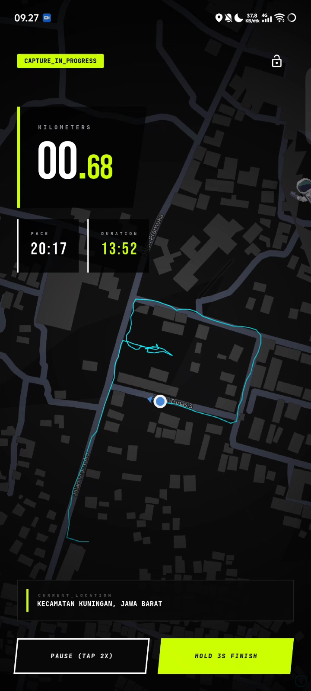
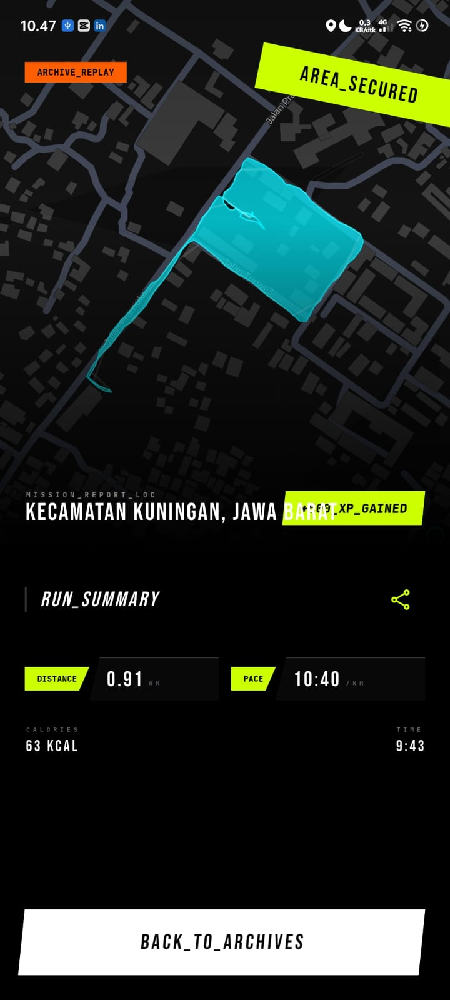
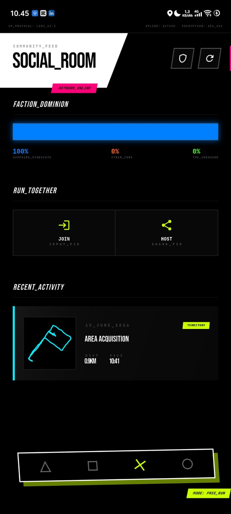
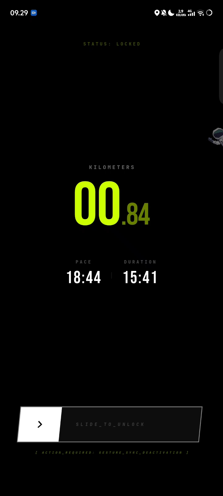

# LARI2: Your City. Your Territory.

LARI2 transforms outdoor running into a real-time geospatial territory conquest game. Runners claim physical areas by completing route loops, competing for global dominance.

## 🚀 Overview
LARI2 is a gamified fitness application built on a high-performance geospatial engine. It merges tactical UI design with real-time tracking to turn your daily run into a competitive territory expansion mission.

### Technical Architecture
- **Backend (The Engine):** Built with **Golang (Go)** for high-concurrency and efficient spatial data processing using **PostGIS**.
- **Frontend (The Interface):** Built with **Flutter & Dart** to deliver a responsive, neon-aesthetic tactical experience.
- **Geospatial Intelligence:** Custom algorithms perform loop detection and area conquest processing, enabling users to claim real-world territory.

## 📱 Visual Showcase

| Active Workout | History Detail |
| :--- | :--- |
|  |  |
| **Social Room** | **Pocket Mode** |
|  |  |

## 📱 Documentation
- [Installation Guide](INSTALLATION.md)
- [Project Documentation](docs/PROJECT_DOCS.md)

## 🛠 Features
- **Territory Conquest:** Capture real-world locations by running in closed loops.
- **Dynamic Factions:** Join a guild and compete for global leaderboard dominance.
- **Elastic Trails:** High-precision GPS tracking with custom snap-to-road algorithms.
- **Social Room:** Connect with runners, see recent global missions, and plan future conquests.

---
*Built for the competitive runner.*
EOF
